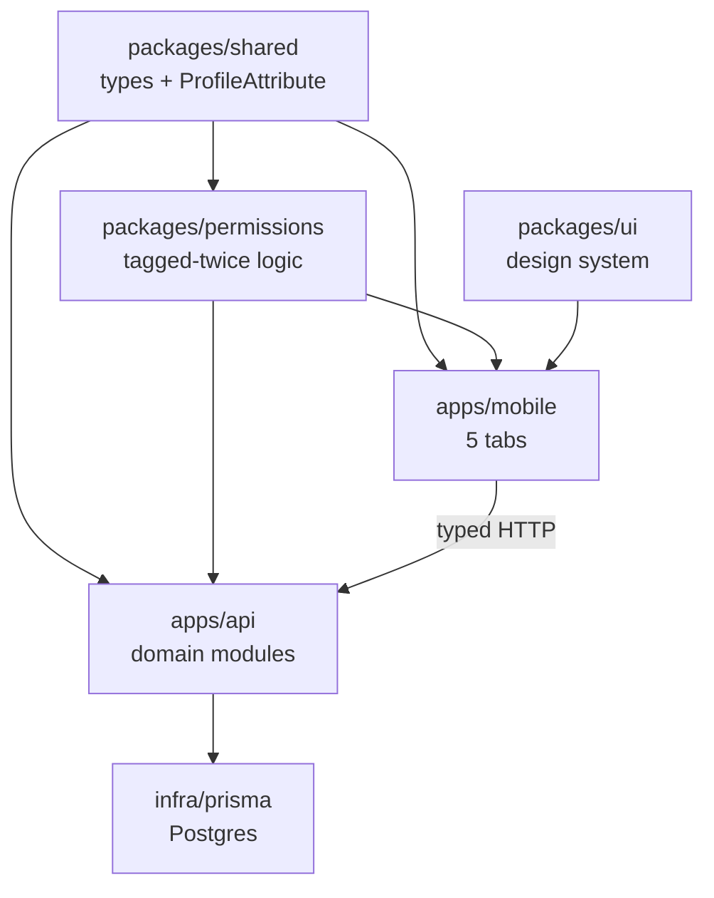

# Bridger — Repository Architecture

A map of the whole codebase: every folder, what lives in it, and how the pieces connect. Built so a coding agent (or you) can scaffold the infrastructure directly from this document.

---

## Stack (assumed — swappable)

| Layer | Choice | Why |
|---|---|---|
| Monorepo | pnpm workspaces + Turborepo | one repo, shared types, one install |
| App (iOS + Android + web) | Expo (React Native) + Expo Router | **one codebase, three targets** — Expo Router renders web too (see DATA.md) |
| API | NestJS (TypeScript) | modular by domain; fronts the complex logic (matching, RAG, payments, admin) |
| Database + vectors | **Supabase** — Postgres + **pgvector** | relational data + embeddings for RAG in one place |
| Auth | **Supabase Auth** — email + Google + Apple | matches onboarding sign-in options |
| Media | **Supabase Storage** | signed URLs, never public, retention windows |
| Permissions | **Row-Level Security (RLS)** | the tier model enforced at the row level, defense-in-depth |

> Data, privacy zones (PII vs de-identified vs derived-AI), the RAG matching design, and the full schema live in **`DATA.md`**. If you change the stack, the top-level layout and domain module names stay the same.

---

## The one idea the whole repo is built around

Everything we designed reduces to a single core type: a **fact about a person, tagged twice** — who can see it, and whether the matchmaker may use it. This type lives in `packages/shared` and is imported by both the API (to enforce) and the mobile app (to predict what to show). Get this right and the three surfaces (onboarding, friend-card, matchmaker) and three tiers (close / friends / acquaintances) all fall out of it.

```ts
// packages/shared/src/model/profile-attribute.ts

export type Tier = 'close' | 'friend' | 'acquaintance' | 'none';
// 'none' = private but still matchable (personality signals used by Discover, shown to no one)

export type Layer =
  | 'essential'        // collected at onboarding
  | 'profile'          // the resource-card depth, added anytime
  | 'connection';      // opt-in "what I want to be matched on"

export interface ProfileAttribute<T = unknown> {
  id: string;
  ownerId: string;
  key: string;              // e.g. "favorite_candy", "love_language"
  value: T;
  layer: Layer;
  visibleToTier: Tier;      // TAG 1 — the lowest tier that may see it
  matchable: boolean;       // TAG 2 — may the matchmaker read it?
  updatedAt: string;
}
```

---

## Top-level layout

```
bridger/                        # the consumer app monorepo
├── apps/
│   ├── mobile/                 # Expo React Native app (the 5 tabs)
│   └── api/                    # NestJS backend (shared by every surface below)
├── packages/
│   ├── shared/                 # types + the ProfileAttribute model (source of truth)
│   ├── permissions/            # pure tier/visibility/matchable logic (imported by both apps)
│   └── ui/                     # shared design-system components + tokens
├── infra/
│   ├── prisma/                 # schema + migrations + seed
│   ├── docker/                 # local Postgres + storage
│   └── env/                    # env templates per environment
├── docs/                       # this file + product notes
├── package.json                # workspace root
├── pnpm-workspace.yaml
└── turbo.json                  # build/test pipeline
```

### Separate surfaces (outside this monorepo)

Kept apart deliberately so edits to them can never break the live consumer app (see `ADMIN.md`):

- **Admin console** — its **own repository**. Organizer-only; talks to the same `api`. Can be rebuilt freely with zero blast radius on users.
- **Marketing website** — a public site (also hosts always-takeable launched quizzes). Its "log in" hands off into the app's auth; repo-sharing vs. separate is an open call, only the login bridge is required.
- **Co-op portal** — an existing external, member-gatekept surface Bridger only links to; not built here.

All four share the `api`.

---

## `packages/shared` — the contracts

Single source of truth for every type crossing the wire. No logic, no framework code — just types and enums, so both apps depend on it and nothing drifts.

```
packages/shared/src/
├── model/
│   ├── profile-attribute.ts    # the tagged fact (above)
│   ├── person.ts               # identity, not the facts
│   ├── tier.ts                 # Tier enum + ordering (close > friend > acquaintance)
│   ├── layer.ts                # Layer enum
│   ├── story.ts                # story + weekly-summary shapes
│   ├── reaction.ts             # marco-polo video / sticker reaction
│   ├── event.ts                # event + "who should meet" suggestion
│   ├── poll.ts
│   ├── touch-grass.ts          # the "I'm bored" signal
│   ├── quiz.ts                 # quiz definition + result
│   ├── suggestion.ts           # friend suggestion + the "why"
│   ├── connection.ts           # an edge between two people + how it was made
│   └── commonality.ts          # the "what you have in common" payload
├── dto/                        # request/response shapes per surface
│   ├── onboarding.dto.ts       # the ESSENTIAL layer only
│   ├── friend-card.dto.ts      # facts filtered by viewer tier
│   ├── matchmaker.dto.ts       # only matchable attributes
│   └── reveal.dto.ts           # strongest-link + other-commonalities for the reveal
└── index.ts
```

---

## `packages/permissions` — the "tagged twice" engine

Pure functions, zero dependencies. This is the one place that decides visibility and matchability. The API imports it to **enforce**; the mobile app imports it to **predict** (so the UI never shows a control that the server would reject).

```
packages/permissions/src/
├── can-view.ts                 # canView(attr, viewerTier): boolean
├── visible-attributes.ts       # filter a profile down to one viewer's tier
├── matchable-attributes.ts     # pull only attrs where matchable === true
├── tier-order.ts               # is close >= friend >= acquaintance?
└── defaults.ts                 # default visibility per (layer, category)
```

`defaults.ts` is what spares users from toggling every field — it encodes "facts → friend+, connection signals → matchable but shown to no one, sensitive → close only," with per-attribute overrides layered on top.

---

## `apps/api` — the backend, one module per domain

Every module follows the same NestJS shape, so the pattern below repeats for each:

```
<module>/
├── <module>.module.ts          # wires it together
├── <module>.controller.ts      # HTTP routes
├── <module>.service.ts         # business logic
├── <module>.repository.ts      # Prisma access
└── dto/                        # local request/response types (extends shared/dto)
```

The modules:

```
apps/api/src/
├── main.ts
├── app.module.ts
├── common/                     # guards, interceptors, the permissions guard
│   └── guards/tier.guard.ts    # rejects reads above the caller's tier
├── auth/                       # sign up, sign in, sessions; email + Google + Apple (OAuth)
├── profiles/                   # the pool + the 3 layers (essential/profile/connection); "Currently" = Spotify link + current book
├── attributes/                 # individual tagged facts; every write sets visibility+matchable
├── activities/                 # weekly hosted activity/challenge: prompt, posts (in-app capture), double-tap hearts; admin on/off (see ADMIN.md)
├── connections/                # the ACT of connecting: requests, accept/decline, links, QR
├── tiers/                      # sort people into close / friend / acquaintance
├── stories/                    # 3/day + 20s + capture-only; themed prompts (admin); archive = calendar; rolling 30-day media retention
├── reactions/                  # circle-video (marco-polo) reactions + threaded text replies to stories (see STORIES.md)
├── feed/                       # assembles the Home hub (the conditional top strip)
├── discovery/                  # opt-in gate; 1st/2nd-degree suggestions + "why"; network map; approvals live here (see DISCOVER.md)
├── matching/                   # RAG matchmaker over de-identified facts + embeddings (opaque IDs, no PII); see DATA.md
├── events/                     # create, friends' events, community placeholder, who-should-meet
├── polls/                      # create + vote; poster-set duration (max 1 week); answered items sink in the Catch-Up
├── touchgrass/                 # the "I'm free / I'm bored" bat-signal
├── quizzes/                    # quiz registry, scheduling live quiz, results; plugins live in mobile/quizzes/* (see ADMIN.md)
├── quotes/                     # Inside Jokes wall: sticky notes + photo tags; quote a person, tag people and the event; shares to those tagged plus everyone there; cross-posts; feeds Home
├── bucket/                     # profile-only bucket list: solo or with-friends items, public/private, checkable
├── payments/                   # processed payments: event-cap expansion, add-storage (chip-in handles are NOT processed here)
├── coop/                       # co-op portal, feedback, announcements; membership records unlock co-op widgets + full storage
├── notifications/              # tier-aware push + Home notifications preview → Notifications page (replies, mutual-connection, requests, touch-grass)
└── messages/                   # RESERVED — chat/DMs (planned, not yet designed); the header messages slot will point here
```

Two rules enforced at this layer, by design, so they can never leak into a screen:
- **No public follower counts.** There is no endpoint that returns a follower total to anyone but the owner.
- **No story view counts to others.** View data, if stored at all, is owner-only and has no shared-read route.

---

## `apps/mobile` — the 5 tabs (expo-router, file-based)

Routing is file-based: the folder structure *is* the navigation graph.

```
apps/mobile/
├── app/
│   ├── _layout.tsx             # root: decides auth vs app
│   ├── (auth)/                 # pre-login stack
│   │   ├── welcome.tsx         # "why Bridger exists" marketing screen
│   │   ├── sign-in.tsx
│   │   └── sign-up.tsx
│   ├── (onboarding)/           # first-time setup — the ESSENTIAL layer only (see ONBOARDING.md)
│   │   ├── privacy.tsx         # "you control every field" — shown FIRST
│   │   ├── name.tsx            # required
│   │   ├── photo.tsx           # in-app capture + shared house filter
│   │   ├── likes.tsx           # what you like / enjoy
│   │   ├── first-quiz.tsx      # seeds the matchmaker
│   │   ├── coop.tsx            # join the co-op?
│   │   └── welcome-in.tsx      # sets onboardingComplete → Home
│   ├── (tabs)/                 # the main app shell + FLOATING pill tab bar (detached, dynamic — see DESIGN.md)
│   │   ├── _layout.tsx         # defines the 5 tabs + floating nav
│   │   ├── home.tsx            # hub: user-arrangeable widgets; defaults + live quiz/announcements set by admin
│   │   ├── events.tsx          # create / friends' events / community (coming soon)
│   │   ├── discover.tsx        # suggestions + connection-intent settings + network graph
│   │   ├── friends.tsx         # contact list + drag-drop tiering
│   │   └── profile.tsx         # your page + settings; tabs: About | Stories | Quotes | Settings (see PROFILE.md)
│   ├── (connect)/              # making a new connection
│   │   ├── add.tsx             # search / generate invite link
│   │   ├── qr.tsx              # show my QR + scan someone else's
│   │   └── requests.tsx        # incoming + outgoing (accept / decline) — surfaced on Discover (see DISCOVER.md)
│   ├── reveal/[id].tsx         # story-style "what you have in common" reveal + tier prompt
│   ├── person/[id].tsx         # SHARED friend-profile; tabs: About them | In common | + your private note
│   ├── story/[id].tsx          # full-screen story viewer + week-summary peek
│   ├── notifications/index.tsx # notifications page (feed preview links here); replies, mutual-connection, requests
│   ├── messages/               # RESERVED — chat/DMs, not yet designed; header top-right slot points here
│   └── coop/index.tsx          # co-op portal (linked from Home)
├── features/                   # logic per domain, mirrors the API modules
│   ├── stories/  reactions/  feed/  discovery/  matching/
│   ├── events/   polls/       touchgrass/  quizzes/
│   ├── tiers/    attributes/  profiles/    coop/  connections/
├── quizzes/                    # ISOLATED quiz plugins — each quiz is its own folder (see ADMIN.md)
│   ├── _host/                  # generic loader: mounts a quiz by slug
│   ├── registry.ts             # slugs + status (live | draft | archived) — only shared file
│   └── <quiz-slug>/            # manifest.ts, Quiz.tsx, questions.ts, result.ts, styles.module.css (SCOPED)
├── delight/                    # ISOLATED easter-egg plugins — flag-gated quirks (see DELIGHT.md)
│   ├── _host/                  # mounts enabled delights; no-op when none on; errors caught
│   ├── registry.ts             # {id, enabled, scope} — only shared file
│   └── <delight-id>/           # manifest.ts, Delight.tsx, styles.module.css (SCOPED)
├── components/                 # reusable UI built on packages/ui
│   ├── StoryTile.tsx           # rectangular tile, pic in corner, image = story
│   ├── StoryViewer.tsx         # tap-through + reaction bar
│   ├── WeekSummaryPeek.tsx     # the "yesterday / day before" recap
│   ├── TouchGrassButton.tsx
│   ├── ConditionalStrip.tsx    # renders nothing when empty
│   ├── RevealCard.tsx          # one frame of the connection-reveal story
│   ├── TierPrompt.tsx          # "how do you know each other?" → sets tier
│   ├── FriendNetworkGraph.tsx  # Discover: you + friends + cross-links, with activities
│   └── TierPicker.tsx          # drag-drop close/friend/acquaintance
├── lib/
│   ├── api-client.ts           # typed client using packages/shared
│   └── permissions.ts          # re-exports packages/permissions for UI prediction
└── state/                      # local/query state (React Query or Zustand)
```

---

## Connecting & the reveal flow (`connections` module)

How two people become connected, and what happens right after. The `connections` module owns the *act* of connecting; it does **not** compute overlap itself — it calls `matching` (which reads matchable attributes) filtered through `permissions` by the tier the user just set.

```
apps/api/src/connections/
├── connections.module.ts
├── connections.controller.ts
├── connections.service.ts       # orchestrates request → accept → edge created
├── connections.repository.ts    # the connection edges (Prisma)
├── invite-links.service.ts      # generate + redeem one-time invite links
├── qr-tokens.service.ts         # issue + scan short-lived QR tokens
└── dto/
```

### Three ways in — two instant, one needs accepting

- **Invite link** and **QR at a meetup** are *instant*. Both parties acted (one sent / showed, the other tapped / scanned), so consent is already mutual — the edge is created immediately, no accept step.
- **Add someone** (from search or a suggestion) is *one-sided*, so it becomes a request the other person accepts or declines in `(connect)/requests.tsx`.

### The reveal is shallow and pairwise (this is the anti-redundancy rule)

Right after connecting, `reveal/[id].tsx` runs a short story-style sequence about *only the two of you*. It never lists other people to meet — that would duplicate Discover. Order matters:

1. **Tier prompt first** — "How do you know each other? Just met / already friends." Sets the tier, which gates visibility. Writes through the `tiers` module. Runs *before* any commonality is shown, so nothing private is ever flashed.
2. **What connects you most** — the single strongest shared link.
3. **Other things in common** — the grab-bag: matching quiz results, similar travel, both morning people, both runners (Pilates vs CrossFit is fine — shared category, different specifics).
4. **Where to next?** — two exits: *their profile* (`person/[id]`) or *Discover, updated*.

### The communal expansion lives on Discover, not the reveal

Choosing "Discover, updated" (or just opening Discover after a new connection) is where the group-level suggestions surface. Discover shows a notification badge, recomputes, and renders `FriendNetworkGraph`: you, your new friend, their friends, your friends, and the cross-links (e.g. "your friend D and their friend C would get along too"). Every suggested edge carries its *why* plus concrete shared activities ("this crew would go mountain biking / rock climbing / take photos") and a light group "vibe" label. Reveal stays intimate; Discover stays relevant.

---

## `packages/ui` — the design system

Implements the visual + motion direction in `DESIGN.md` (playful retro-modern: eggshell/black canvas, pixel headers, flat colorful surfaces, metallic primary buttons, synth only on Discover, everything breathes).

```
packages/ui/src/
├── tokens/                     # eggshell/black canvas, accent palette, pixel + sans fonts, radii (per DESIGN.md)
├── primitives/                 # Button (flat + retro-metallic), Card, Pill, Chip, Sheet, PixelHeading
├── motion/                     # shared transitions/easings; transform+opacity only; prefers-reduced-motion
└── layout/                     # Tab shell, screen scaffolds
```

---

## How it all connects



The load-bearing edges: `shared` feeds everyone, `permissions` is imported by **both** api and mobile (enforce + predict), and mobile only ever talks to the outside world through the typed API client.

---

## Feature → folder map

| Feature we designed | API module | Mobile route/feature |
|---|---|---|
| 3 depth layers (essential/profile/connection) | `profiles`, `attributes` | `(onboarding)`, `profile.tsx` |
| Tiers + drag-drop sorting | `tiers` | `friends.tsx`, `TierPicker` |
| Add / link / QR to connect | `connections` | `(connect)/add`, `qr`, `requests` |
| Request → accept / decline | `connections` | `(connect)/requests.tsx` |
| Connection reveal + tier prompt | `connections` + `matching` | `reveal/[id]`, `RevealCard`, `TierPrompt` |
| Friend network graph + activities | `discovery` + `matching` | `discover.tsx`, `FriendNetworkGraph` |
| Who-sees-what permissions | `attributes` + `common/guards` | `profile.tsx` settings |
| Story tiles + tap-through | `stories` | `StoryTile`, `story/[id]` |
| Weekly summary / "peek" | `stories` | `WeekSummaryPeek` |
| Marco-polo + sticker reactions | `reactions` | `StoryViewer` |
| Home hub + conditional strip | `feed` | `home.tsx`, `ConditionalStrip` |
| Friend suggestions + "why" | `discovery` | `discover.tsx`, `person/[id]` |
| Matchmaker | `matching` | `discover.tsx` |
| Events + community placeholder | `events` | `events.tsx` |
| Polls | `polls` | `home.tsx` |
| Touch-grass bat-signal | `touchgrass` | `TouchGrassButton`, `home.tsx` |
| Quizzes + rankings/graphs | `quizzes` | `home.tsx`, `discover.tsx` |
| Co-op portal | `coop` | `coop/index.tsx` |

---

## Suggested build order

1. `packages/shared` + `packages/permissions` + `infra/prisma` schema — the spine.
2. `apps/api`: `auth` → `profiles` → `attributes` → `tiers`. Now the pool + permissions work end to end.
3. `apps/mobile`: `(auth)` → `(onboarding)` → `profile.tsx` → `friends.tsx`. A usable core.
4. `connections` + `matching` → people can actually connect and see the reveal. This is what makes the app *social*, so it comes early.
5. `stories` + `reactions` + `feed` → the social loop.
6. `discovery` (incl. `FriendNetworkGraph`) + `quizzes` → the connective tissue.
7. `events`, `polls`, `touchgrass`, `coop` → the extras.

Everything after step 2 plugs into the same spine, so each feature is additive — no re-architecting.
