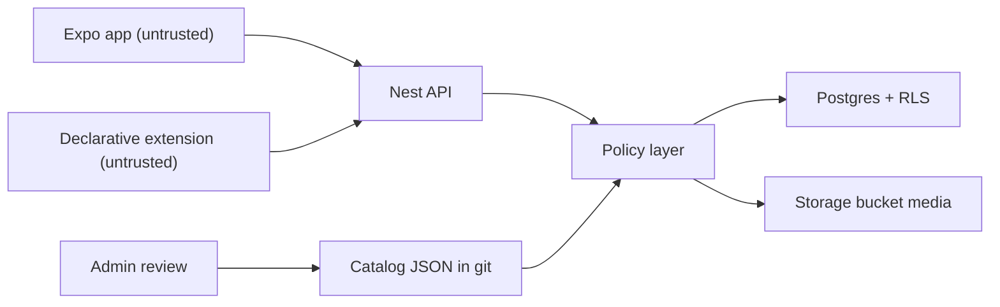
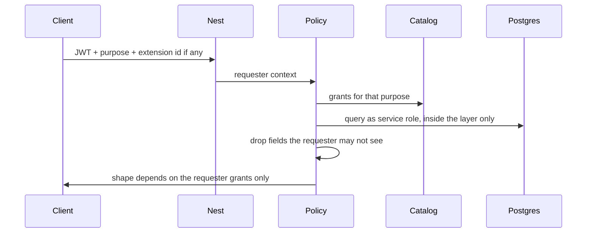

# 01 · Target architecture

The data rails after this plan. Visual design is out of scope. Privacy wins when it conflicts with extensibility.

This file is the map. Details live in `02` through `08` and the ADRs in `guide-docs/adr/`. Every table and policy named here is in `00-DATA-INVENTORY.md`. If it is not, this file says "not found".

**Status:** proposed. Founder gates are listed in `06-IMPLEMENTATION-PLAN.md` and `08-OPEN-QUESTIONS.md`. Nothing here changes the running app until a later phase ships it.

---

## What is wrong today (the constraint)

From the inventory:

- Nest reads and writes through `SupabaseService.admin` (`apps/api/src/supabase/supabase.service.ts`), the service-role key. Row-level security does not apply to that client.
- The only shared checker is `apps/api/src/common/visibility.ts` (`isBlocked`, `viewerTier`). It is not on every query. `GET /jname/leaderboard` returns friends' `jname_results` even though `jname_results_select_own` is own-row only.
- The phone's publishable-key client is narrow: Auth, plus `media` upload and insert in `apps/mobile/lib/media-upload.ts`. `media_select` is acquaintance-wide. `stories_select` is tiered. Those fences do not match. Storage policies for bucket `media` were not found.
- 22 tables have RLS and no policy. The phone cannot read them. The service role can.
- Messages tables were not found. An extension cannot be a messages app until a ciphertext primitive exists.

So the target is not "trust RLS more." The target is one server policy layer that is the only way to touch user data, with RLS kept as a second fence for the publishable key.

---

## Pieces



| Piece | Role | Exists today |
|---|---|---|
| Catalog | Only definition of fields, subjects, purposes, consent, retention, derivations. | Seed only: `inventory/catalog-seed.json`. Purposes and consent are empty on purpose. |
| Compiler | Turns the catalog into TypeScript types, consent copy, a runtime snapshot, and RLS drafts. | Not found. |
| Policy layer | Deny by default. Filters fields before JSON is sent. Logs the decision. | Not found. `visibility.ts` is a partial, optional helper. |
| Postgres RLS | Defense in depth for the publishable key. Generated where it can match the catalog. | 144 policies. Not applied to Nest. |
| Extension host | Declarative manifests only. No user code on the server. No user code in the app in v1. | Not found. |
| Admin review | Approves catalog proposals and manifests. | Admin app exists. This queue does not. |
| Audit log | Who read what, via core or an extension, for which purpose, allow or deny. | Not found. |

ADRs: `0001` policy location, `0002` declarative extensions, `0003` catalog in git, `0004` consent receipts and the omit rule.

---

## Request path

Every user-data read or write, including ones that today call `this.supabase.admin.from(...)` directly, goes through the policy layer.



Requester context (required on every call):

```text
actor_user
acting_via: core | extension:<id>@<version>
purpose
subject_user ids
relationship_state: self | tier | none | blocked
consent_grants: receipt ids that are still active
```

`acting_via: core` is today's app. An extension id that the subject has not installed cannot add grants. Friendship grants stay the core grants (`tiers`, `can_view`). See `04-EXTENSION-MANIFEST-SPEC.md`.

The service-role client stays in the API process. It is not passed to the phone, to admin browsers, or to extension code. New call sites outside `apps/api/src/policy/` are a standing-rule failure (`07-STANDING-RULE.md`).

---

## What happens to today's RLS

| Group | Examples from the inventory | Target |
|---|---|---|
| Keep, and mirror in the policy layer | `attributes_select` via `can_view(owner_id, visible_to_tier)`, `user_contacts_all` own-row, `pending_people_all` author-only, `friend_notes_all` author-only | Policy layer enforces the same predicate even though the service role skips RLS. RLS stays so a publishable-key bug cannot widen it. |
| Replace because they are wider than the product | `media_select` (any acquaintance) vs `stories_select` (tier). `activity_posts_select` and `activity_hearts_select` (`USING (true)`). `recap_submitted_questions_select` (`USING (true)` on friend-typed text). `coop_beta_votes_select` (`USING (true)` on `user_id` + `choice`) | Founder gate before behavior changes. Until then, shadow-log only. See `08`. |
| Keep as public co-op copy | `coop_mission_principles_select`, `coop_economics_select`, `coop_roles_select` (anon + authenticated, `USING (true)`) | Catalog them as `coop_public`. Extensions do not get a broader read than this. |
| Keep as signed-in catalog reads | `quiz_registry_select`, `quiz_questions_select`, `delights_select`, `weekly_activities_select`, `admin_config_select` | Purpose `render_feed` or `coop_public` / `admin_ops`. Not a license to read user answers. `quiz_responses` stays own-row. |
| No policy today (client deny, service allow) | Assistant sessions and turns, `person_embeddings`, `person_summaries`, `week_summaries`, `music_oauth_states`, `freshness_prompts`, `module_moderator_notes` | Policy layer is the only reader. Do not add a permissive policy. Phone and extensions never select these tables. Embeddings stay inside matching. |

`public.can_view` stays the relationship predicate. `viewer_tier(uuid, uuid)` and `is_blocked(uuid, uuid)` stay dropped (`0013_harden_functions.sql`). The policy layer may call `can_view` only as the signed-in user, or it may duplicate that SQL in process using the same rules as `visibility.ts`. It must not reintroduce a function that answers "how did X sort Y?" for arbitrary pairs.

---

## Phone and storage

The phone is untrusted. Target: it does not insert into `media` and it does not hold a client that can `.from()` any table.

Phase shape that does not break the current TestFlight build:

1. API grows a signed upload (or a server-side upload) that writes the `media` row itself.
2. The current `uploadMedia` path keeps working until a minimum app version.
3. After that version is the floor, the publishable key loses table grants. Storage policies, missing from git today, are written to match the catalog: object path `{userId}/...`, read only when the policy layer would return that `media` id.

Until step 3, `media_select` remains the hole described in the inventory. Tightening it is a founder gate because acquaintances might lose a read they have now.

---

## Catalog at runtime

Source of truth is JSON in git (`adr/0003`). A build step compiles it. The running API reads the compiled snapshot, not a hand-edited table.

Jsonb bags are not one field. `attributes.value` and `user_settings.onboarding_draft` hold many facts (birthday and job are keys, not columns). Catalog ids for those are `public.attributes.value#<key>`. An unknown key is `sensitive` and denied to everyone except the owner until it is registered. An extension never receives the whole jsonb.

---

## Extensions

v1 is declarative. A manifest names purposes and fields from the catalog. The app renders core primitives. No extension JavaScript runs. No extension code runs in Nest. Rationale: `adr/0002`.

The messages dogfood cannot start from a table. Messages were not found. The rails add a ciphertext primitive first (bodies unreadable by the policy layer), then a first-party manifest that only requests `deliver_message`. If that manifest cannot express the spec in `guide-docs/complete/MESSAGES.md`, the rails are not done. We do not "fix" that by running extension code on the server.

---

## What this refuses

- A client-side policy check as the control. The inventory already shows the phone can insert `media` under RLS that is wider than stories.
- Handing an extension the service-role key, the publishable key, or raw SQL.
- A new `core_required` field so an extension works. Core required is only for something the product cannot function without, and it needs a written reason.
- Server-side extension code.
- Analytics that are not catalog rows with purpose `analytics_aggregate`.
- Follower counts, public totals, or extension leaderboards. `GET /jname/leaderboard` is a friend-grouped board, not a template for extensions.

---

## Build order

Implementation order, TestFlight rules, and effort are in `06-IMPLEMENTATION-PLAN.md`. Short version: catalog and the standing rule first (no user-visible change), policy layer in shadow mode second (still no user-visible change), enforcement and the media fence only after a founder yes.
