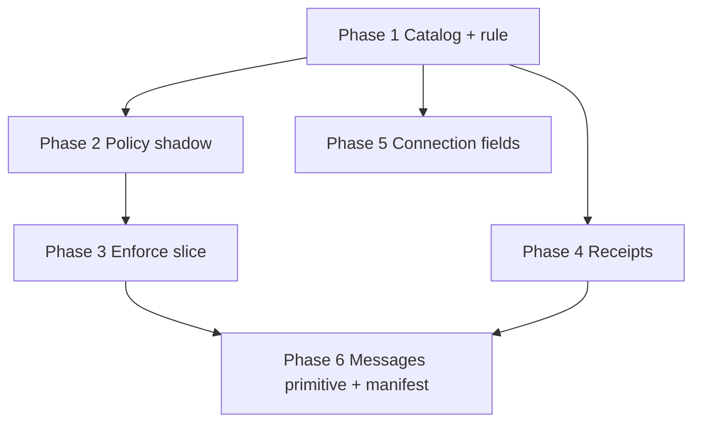

# 06 · Implementation plan

Each phase can ship on its own. None of them require the later ones to be safe for the current TestFlight build. Behavior changes are marked and wait for the founder.

Estimates are ranges, not promises. One engineer who already knows this repo. Add time if the phase includes a store build.

---

## Sequence

Phase 4 and Phase 5 can overlap Phase 2. Phase 6 waits on enforce mode and on receipts, because a messages extension on today's service-role path would copy the hole we are closing.

| When | Phase | User-visible? |
|---|---|---|
| Day 1 to 14 | 1. Catalog file, standing rule, CI report then fail-closed on drift | No |
| Day 14 to 40 | 2. Policy module, shadow logs | No, if shadow does not change JSON |
| Day 30 to 70 | 3. Helper fixes that do change alerts. Media fence only after a yes | Alerts get quieter if prefs were ignored. Media only if founder says so |
| Day 40 to 70 | 4. Receipt tables, grandfather existing flags | No prompt for old fields |
| Day 40 to 70 | 5. Empty derivation and receive columns | No, defaults are "show the original" |
| Day 70 to 120 | 6. Ciphertext messages, then the first-party manifest | New messages feature. Demo mode unchanged |

Day 100 is not "extensions in the wild." Day 100 is: shadow evidence reviewed, catalog enforcing, receipts in place, messages schema designed and behind the policy layer if the founder has accepted ciphertext. A public extension install before that is out of scope.

---

## Phase 1 · Catalog and the standing rule (Day 1)

**Depends on:** Phase 0 inventory.

**Ship:**

- Promote `inventory/catalog-seed.json` into `guide-docs/platform/catalog/catalog.json` using the schema in `02`. Keep `needs_review`. Do not invent purposes to look finished. A row may ship with `purpose_tags: ["account_self"]` only when that is obviously true (`user_contacts` own read). Unsure rows stay empty until a person sets them, and CI enforcing mode is delayed until empties are gone or explicitly `purpose_tags: ["unset_pending_review"]` is rejected. Practical rule: CI Phase 1 fails on **missing rows**, not on empty purposes. A second switch, founder-flipped, fails on empty `consent_basis`.
- `.cursor/rules/data-catalog.mdc` is already written with this plan. Follow it.
- GitHub Action, new job beside `.github/workflows/ci.yml`: run `node scripts/data-inventory/generate.mjs` and diff tables, columns, and routes against the catalog. Week 1 posts a comment. Week 2 fails the check. Do not fail `main` on day 1 before the catalog file exists.
- PR template checklist (`.github/PULL_REQUEST_TEMPLATE.md`).
- No Nest change. No migration. No app release.

**Effort:** 4 to 8 days. Most of it is splitting `attributes.value` keys we can find in code, and listing analytics ids. Uncertainty: high on analytics, low on columns (the generator already lists them).

**Reversible:** delete the catalog file and the workflow. The app does not read them yet.

**Founder:** no, unless a row is marked `core_required`. Default is not to use that class in Phase 1.

---

## Phase 2 · Policy shadow (Day 14)

**Depends on:** Phase 1 catalog ids existing for the routes we wrap.

**Ship:**

- `apps/api/src/policy/` with the requester context from `03`.
- Feature services that we wrap first: `stories`, `profiles` / `attributes`, `connections`, `feed`, `jname` leaderboard. They keep returning today's JSON.
- The layer computes the omit set and logs disagreements (RLS would deny, service returned the field). `GET /jname/leaderboard` is the known case.
- Invariant tests run against the shadow decision, not against the public response, so we can see failures without changing TestFlight.

**Effort:** 2 to 4 weeks. Uncertainty: medium. `visibility.ts` is the kernel. Wrapping every `.from()` is the long part. Shadow can start with five modules.

**Reversible:** stop calling the wrapper. No migration.

**Founder:** read the shadow report before Phase 3 enforce. That report is the gate.

**TestFlight:** no response change. Watch logs for crashes in the wrapper. If the wrapper throws, catch and fall through to today's response, and log the fault. A shadow bug must not 500 the feed.

---

## Phase 3 · Enforce a slice (Day 30, after the report)

**Depends on:** Phase 2 report and a founder yes on each behavior change.

**Safe to enforce without a product change:**

- New routes go through the layer for real. Old routes stay on shadow until listed.
- Direct `notifications` inserts move to `notifyIfAllowed`. People who turned a kind off stop getting that kind. People who left defaults on see no change. Files: `connections.service.ts`, `events.service.ts`, `recap.service.ts`, `jname.service.ts`, `delight.service.ts`, `polls.service.ts`, and the `friend_joined` insert inside `merge_pending_people_for_user`.

**Founder yes required (changes who can see something):**

- Tighten `media_select` from acquaintance-wide to "you may see this media id only if some visible parent grants it" (story tier, profile avatar, quip photo). Needs a backfill check so avatars still load for acquaintances (`user_identity_select` is already acquaintance).
- Add storage policies for bucket `media`. Not found in git today.
- Move `apps/mobile/lib/media-upload.ts` behind the API, but keep the old insert working until the minimum app version. Shipping a server-only upload without that dual path breaks older TestFlight builds.
- Tighten `activity_posts_select`, `recap_submitted_questions_select`, and `coop_beta_votes_select`. Questions in `08`.

**Effort:** 3 to 5 weeks after the yes. Dual-running media is the slow part.

**Reversible:** policies are migrations. Write the reverse migration in the same PR. App dual-path means old binaries keep working.

---

## Phase 4 · Receipts (Day 40)

**Depends on:** Phase 1 catalog ids. Does not depend on enforce mode, but extension installs do.

**Ship:** additive tables `consent_receipts`, `catalog_proposals`, `catalog_reviews`. See `adr/0004`.

**Grandfather:** existing `discoverable`, `assistant_enabled`, `visible_to_tier`, `matchable`, and `notif_prefs` stay valid without a new prompt. The receipt table records new changes and all extension data points. Re-prompting every TestFlight user is rejected unless the founder overrides question 4.

**Effort:** 1 to 2 weeks for tables and the check on extension paths. Wiring every settings toggle to write a receipt is another week.

**Reversible:** tables are unused by old clients. Dropping them is safe if no extension data exists yet.

**PRIVACY.md / TERMS.md:** this phase adds a receipt (words shown, time, version). Update both drafts in the same change.

---

## Phase 5 · Connection fields (Day 40)

**Depends on:** catalog properties from `02` and `05`.

**Ship:** empty `derivation_allow` columns and `receive_preferences`. Default means show the original. No ML. No placeholder yet.

**Effort:** under a week for the migration and catalog rows. Enforcement is a later switch, 2 to 4 days, after questions 2 and 3.

**Reversible:** columns default to today's behavior. Dropping them before enforcement changes nothing.

---

## Phase 6 · Messages, then the manifest (Day 70)

**Depends on:** Phase 3 enforce for the new routes, Phase 4 receipts, founder acceptance of ciphertext (the spec already requires it).

**Ship order:**

1. Tables for ciphertext, kind, cap metadata, contact card. RLS own-party only, and the policy layer too. No plaintext column.
2. Core API so the existing messages UI can leave demo fixtures in production builds. Demo mode still uses in-memory plaintext and must not write those tables.
3. First-party manifest `bridger.messages` as in `04`. Install it for a test account. Confirm a second account that did not install it still cannot be read beyond core friendship.
4. Privacy invariants from `03` cover the thread routes.
5. Only then is the rails "done" for the dogfood.

**Effort:** 4 to 8 weeks. Uncertainty: high, because E2E key handling is not designed in this repo (not found). Key storage on device is a product design, not a catalog row. If keys slip, this phase slips past day 120. Do not store plaintext "temporarily."

**TestFlight:** new feature behind the existing messages UI. Old builds that only have demo mode do not call the new routes. Do not point demo mode at production tables.

**Founder:** the enforce flip, and any temptation to let the server read plaintext for moderation. Moderation of ciphertext is an open problem. Question 6 in `08`. Do not solve it by decrypting on the server.

---

## What waits for the founder

- Flip shadow to enforce on an existing route.
- Any RLS tighten in the Phase 3 list.
- `consent_basis: core_required` on a new field.
- `sensitive` catalog changes, consent-basis changes, extension capabilities (the standing rule).
- k if not 10.
- Derivations and the placeholder.
- Server decryption of messages. Default is no.

---

## What we will not do in these phases

- Remove `onboarding_complete` or the old onboarding flow.
- Run extension code in Nest or in a WebView sandbox.
- Give the phone the service-role key.
- Put dependency probes on `GET /health`.
- Auto-merge a PR that touches `sensitive` entries.
